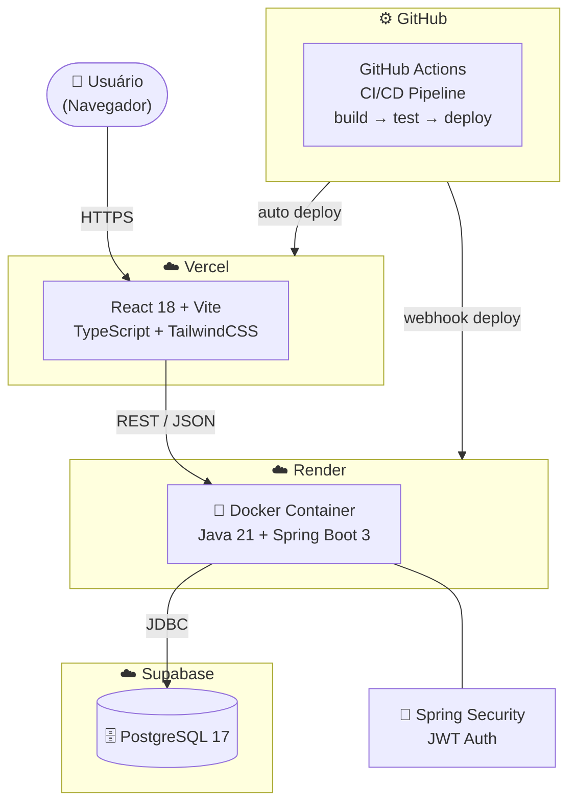

<h1 align="center">
  Peddit 
</h1>

<p align="center">
  Fórum de discussões no estilo Reddit, para incetivar discussões e diversidade.
</p>

<p align="center">
  <a href="https://github.com/PedroKeita/Peddit/actions">
    
  </a>
   
  
  
  
  
  
  
  
</p>

---

##  Sobre o Projeto

O **Peddit** é uma aplicação web full-stack que permite aos usuários criar comunidades temáticas, publicar posts, comentar e votar em conteúdo. O sistema conta com autenticação via JWT, diferenciação de perfis (usuário/admin) e arquitetura em nuvem com containers Docker e pipeline CI/CD automatizado.

---

##  Funcionalidades

### Autenticação e Usuários
- Cadastro com username, email e senha (BCrypt)
- Login com geração de token JWT
- Rotas protegidas por autenticação
- Diferenciação de perfis: `USER` e `ADMIN`

### Posts
- Criar, editar e deletar posts em comunidades
- Feed paginado ordenado por data ou score
- Busca por título em tempo real
- Preview de conteúdo no card do feed
- Apenas o autor ou Admin pode editar/deletar

### Comentários
- Comentar em posts
- Responder comentários (aninhamento recursivo)
- Árvore de comentários com indentação visual

### Votos
- Upvote (+1) e downvote (-1) em posts e comentários
- Cancelamento automático ao votar novamente no mesmo item
- Troca de voto ao votar no sentido oposto
- Autor não pode votar no próprio conteúdo
- Score atualizado em tempo real no front-end

### Comunidades
- Listagem de todas as comunidades
- Criação de comunidades restrita ao Admin
- Posts organizados por comunidade

### Administração
- Moderação de posts e comentários
- Gerenciamento de usuários (banir, promover)

### API e Documentação
- API RESTful documentada via Swagger/OpenAPI
- Validação de dados com Bean Validation
- Tratamento global de erros com mensagens claras
- Logs de acesso e erro com SLF4J + Logback
- Variáveis de ambiente para todas as credenciais

---

##  Stack Tecnológica

| Camada | Tecnologia |
|---|---|
| Back-end | Java 21 + Spring Boot 3 |
| Banco de Dados | PostgreSQL via Supabase |
| Front-end | React 18 + Vite + TypeScript |
| Estilização | TailwindCSS |
| Autenticação | JWT (Spring Security) |
| Container | Docker |
| CI/CD | GitHub Actions |
| Deploy Back-end | Render |
| Deploy Front-end | Vercel |

---

##  Arquitetura


---

## Links de Produção

-  **Front-end:** [https://peddit-jade.vercel.app](https://peddit-jade.vercel.app)
-  **API:** [https://peddit-n01v.onrender.com](https://peddit-n01v.onrender.com)
- **Swagger:** [https://peddit-n01v.onrender.com/swagger-ui.html](https://peddit-n01v.onrender.com/swagger-ui.html)

---

## 📁 Estrutura de Pastas
```
Peddit/
├── .github/
│   └── workflows/
│       └── deploy.yml          # Pipeline CI/CD
├── api/                        # Back-end Spring Boot
│   └── src/
│       └── main/
│           ├── java/com/peddit/peddit_api/
│           │   ├── config/     # Security, CORS, JWT
│           │   ├── controller/ # Controllers REST
│           │   ├── dto/        # Request e Response DTOs
│           │   ├── entity/     # Entidades JPA
│           │   ├── exception/  # Exceções customizadas
│           │   ├── repository/ # Interfaces JPA
│           │   └── service/    # Regras de negócio
│           └── resources/
│               ├── application.yml
│               └── application-dev.yml
├── app/                        # Front-end React
│   └── src/
│       ├── api/                # Configuração do Axios
│       ├── components/         # Componentes reutilizáveis
│       ├── pages/              # Páginas da aplicação
│       ├── services/           # Chamadas à API
│       ├── types/              # Tipos TypeScript
│       └── utils/              # Utilitários
├── Dockerfile                  # Build do back-end
├── docker-compose.yml          # Execução local
├── .env.example                # Exemplo de variáveis de ambiente
└── README.md
```

---

## Pré-requisitos

- Java 21+
- Gradle 8+
- Node.js 18+
- Docker Desktop
- Conta no Supabase (banco de dados)

---

##  Variáveis de Ambiente

### Back-end (`api/`)

Crie um arquivo `.env` na raiz ou configure as variáveis no sistema:

| Variável               | Descrição |
|------------------------|---|
| `DATABASE_URL`         | URL JDBC do Supabase |
| `DATABASE_USERNAME`    | Usuário do banco |
| `DATABASE_PASSWORD`    | Senha do banco |
| `JWT_SECRET`           | Chave secreta JWT (mín. 256 bits) |
| `JWT_EXPIRATION_MS`    | Expiração do token em ms (padrão: 86400000) |
| `CORS_ALLOWED_ORIGINS` | URL do front-end para CORS |

Veja o arquivo `.env.example` na raiz do repositório.

### Front-end (`app/`)

Crie o arquivo `app/.env.development`:
```env
VITE_API_URL=http://localhost:8080
```

---

## Como Rodar Localmente

### Back-end
```bash
# Na raiz do projeto
.\gradlew.bat :api:bootRun --args='--spring.profiles.active=dev'
```

A API estará disponível em `http://localhost:8080`.
Swagger em `http://localhost:8080/swagger-ui.html`.

### Front-end
```bash
cd app
npm install
npm run dev
```

O front-end estará disponível em `http://localhost:5173`.

### Com Docker
```bash
# Na raiz do projeto
docker-compose up --build
```

---

## Pipeline CI/CD

A cada push na branch `main`, o GitHub Actions executa automaticamente:

1. **Build**: compila o projeto com Gradle
2. **Testes**: executa os testes automatizados
3. **Docker**: constrói e envia a imagem para o Docker Hub
4. **Deploy**: dispara o deploy automático no Render via webhook

---

## Melhorias Futuras

### Design e Experiência do Usuário
- [ ] Redesign completo com identidade visual própria (dark mode, tema inspirado no Reddit moderno)
- [ ] Componentes de UI mais ricos: skeleton loading, animações de voto, toasts de feedback
- [ ] Layout responsivo aprimorado para mobile
- [ ] Paginação infinita com scroll no feed em vez de botão "carregar mais"

### Funcionalidades
- [ ] Painel administrativo completo: gerenciar usuários, comunidades e posts em uma interface dedicada
- [ ] Moderação de comunidades: moderadores por comunidade além do admin global
- [ ] Upload de imagens em posts via armazenamento em nuvem (S3 ou Supabase Storage)
- [ ] Posts com tipo "link" além de texto
- [ ] Notificações em tempo real quando alguém responde ou vota no seu conteúdo
- [ ] Sistema de flairs/tags por comunidade
- [ ] Busca global avançada com filtros por data, score e comunidade
- [ ] Histórico de atividade do usuário (posts, comentários, votos)
- [ ] Salvar posts favoritos

### Back-end e Infraestrutura
- [ ] Cache com Redis para o feed principal
- [ ] Rate limiting nas rotas de voto e criação de posts
- [ ] Refresh token para renovação automática da sessão
- [ ] Monitoramento com métricas via Actuator + Prometheus + Grafana
- [ ] Testes de integração automatizados com cobertura mínima de 80%
- [ ] Separação de ambientes dev/staging/prod no pipeline CI/CD

---

